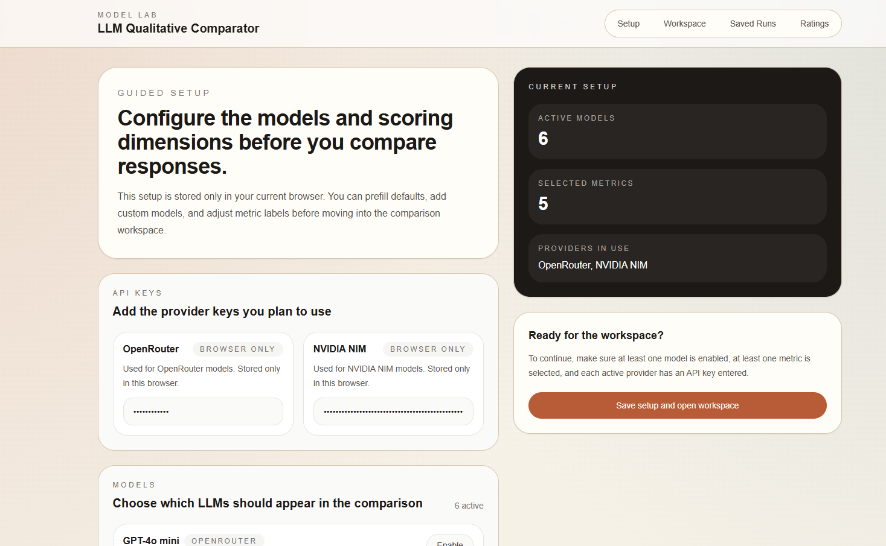
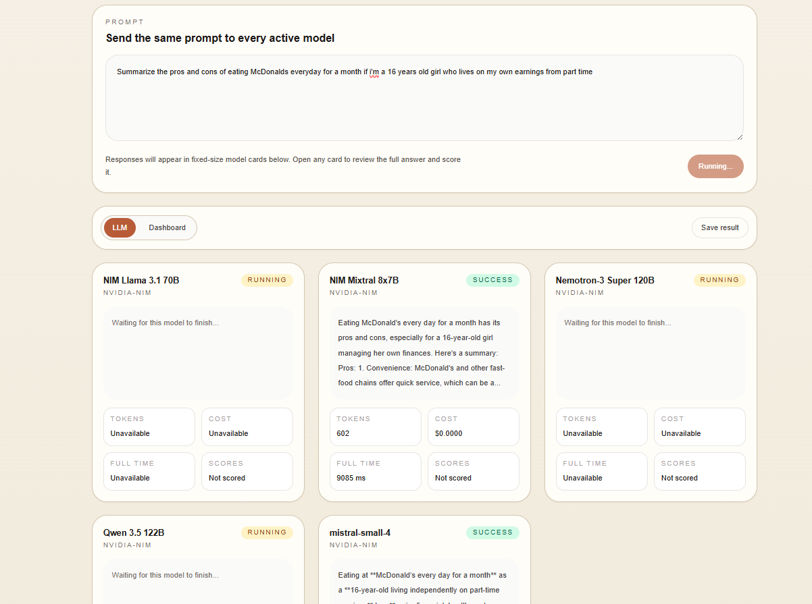
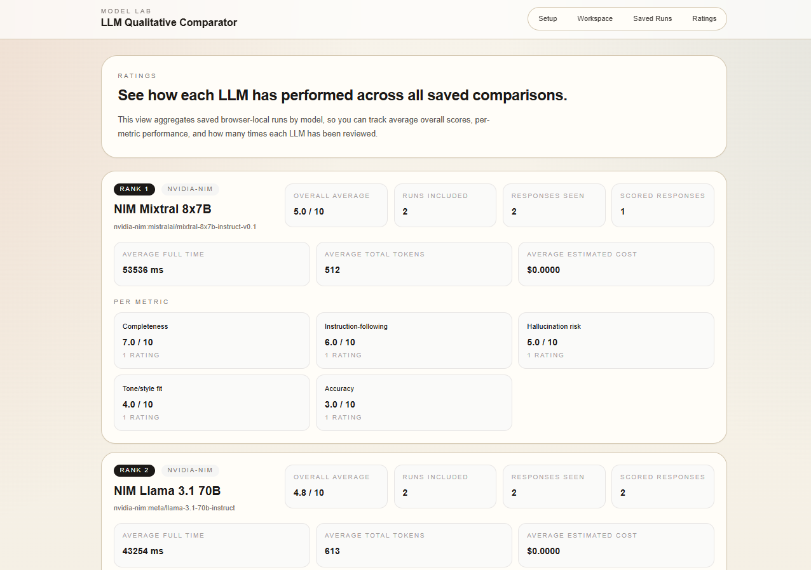

# LLM Qualitative Comparator

A browser-based app for side-by-side LLM comparison with manual qualitative scoring.

This project is designed for people with minimal coding knowledge who still want a structured way to compare model outputs, score them across custom dimensions, and review how models perform over time.

## What It Does

The app lets you:

- configure LLMs from OpenRouter and NVIDIA NIM
- use a curated starter list of models, then add your own
- enter provider API keys in the browser
- choose up to 5 scoring dimensions
- add your own custom scoring dimensions
- run the same prompt across multiple models
- compare responses in fixed-size cards
- open full response details in a modal
- manually score each model from 1-10 on each metric
- view ranking dashboards for cost, tokens, speed, and scores
- save runs in browser-local storage
- review saved runs later
- see cross-run ratings by LLM in the `Ratings` tab

## Demo Flow

1. Go to `Setup`
2. Add your OpenRouter and/or NVIDIA NIM API key
3. Enable the models you want to compare
4. Pick preset metrics or add custom ones
5. Open `Workspace`
6. Enter a prompt and run the comparison
7. Score each model
8. Save the run
9. Review saved runs or aggregated LLM ratings

## Current Features

### Model Setup

- OpenRouter support
- NVIDIA NIM support
- curated default models
- custom model entry
- browser-persisted setup

### Evaluation

- side-by-side prompt execution
- response preview cards
- full response modal
- manual scoring per metric
- custom scoring dimensions
- optional reviewer notes

### Analysis

- dashboard rankings for:
  - least total tokens
  - least estimated cost
  - fastest full response time
  - each selected scoring metric
- drill-down modal for full rankings
- cross-run LLM ratings page with:
  - average overall score
  - per-metric averages
  - average full response time
  - average total tokens
  - average estimated cost

### Persistence

- setup saved in browser storage
- runs saved in IndexedDB
- reopen saved runs
- delete saved runs
- unsaved-changes warning during review

## Tech Stack

- Next.js 15
- React 19
- TypeScript
- Tailwind CSS
- Zustand
- Dexie / IndexedDB
- React Hook Form
- Zod

## Screenshots

You can add repository screenshots under `docs/images/` and reference them here.

Suggested sections:

- `Setup` screen
- `Workspace` prompt + model cards
- `Dashboard` rankings
- `Ratings` aggregated model view

Example markdown:

```md



```

## Getting Started

### Requirements

- Node.js 20+ recommended
- npm

### Install

```bash
npm install
```

### Run Locally

```bash
npm run dev
```

Open:

```text
http://localhost:3000
```

### Production Build

```bash
npm run build
npm start
```

## Provider Notes

### OpenRouter

The app sends prompts to OpenRouter through the app's internal `/api/compare` route.

You need:

- an OpenRouter API key
- a valid OpenRouter model ID

### NVIDIA NIM

The app also supports NVIDIA NIM through the same internal compare route.

You need:

- an NVIDIA API key
- a valid NVIDIA NIM model ID

## Storage and Privacy

This project is browser-local by design.

- API keys are stored only in the local browser storage for convenience
- saved runs are stored in IndexedDB in the same browser
- there is no user account system
- there is no shared backend database
- there is no cross-device sync

If you clear browser storage, your saved setup and runs will be removed.

## Project Structure

```text
src/
  app/
    api/compare/
    ratings/
    saved/
    workspace/
  components/
    dashboard/
    ratings/
    saved-runs/
    setup/
    workspace/
  lib/
    constants/
    providers/
    scoring/
    storage/
    utils/
    validation/
  stores/
  types/
```

## Status

The app currently supports the full browser-local comparison loop:

- configure models
- run comparisons
- score responses
- rank results
- save runs
- review aggregated ratings

Not implemented yet:

- latency to first token
- auth / multi-user mode
- cloud sync
- export to CSV or PDF
- automated model-as-judge scoring

## Contributing

Issues and pull requests are welcome.

If you contribute, it helps to:

- describe the user-facing problem
- include reproduction steps for bugs
- keep browser-local privacy assumptions intact unless the PR intentionally changes that model

## License

[MIT](LICENSE)
